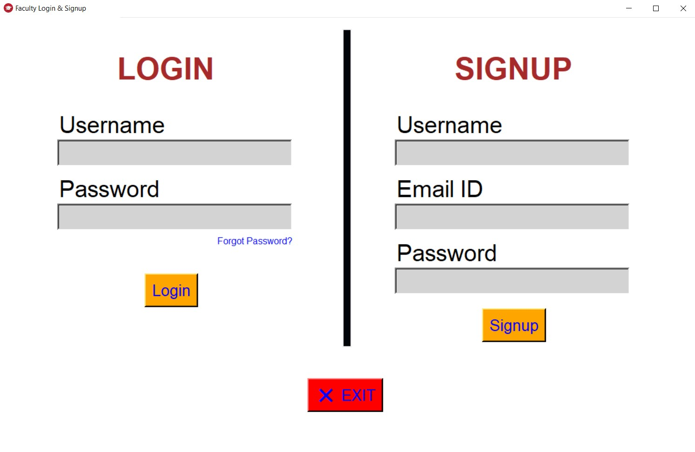
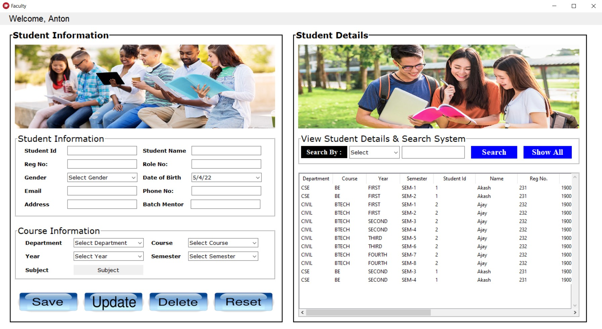
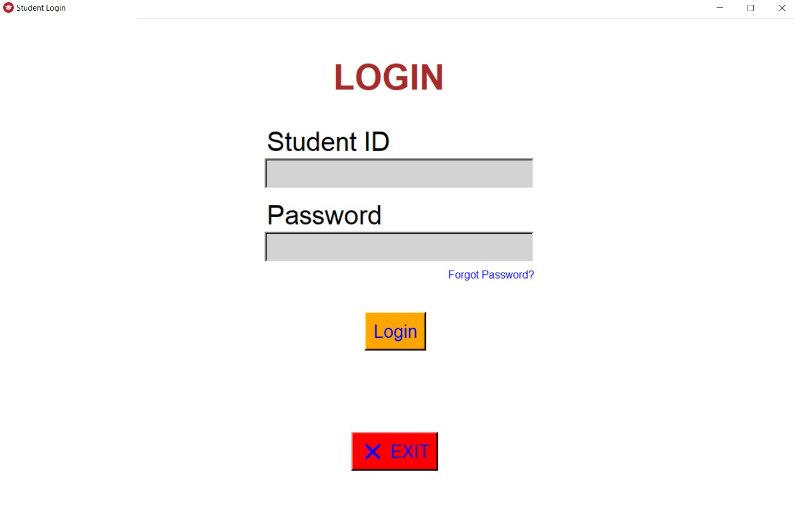
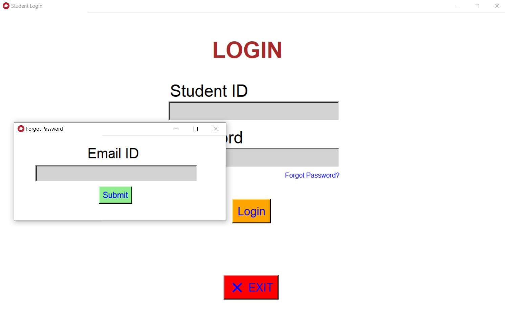
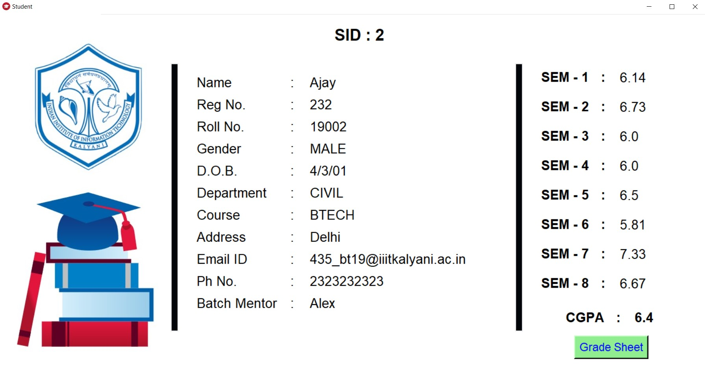
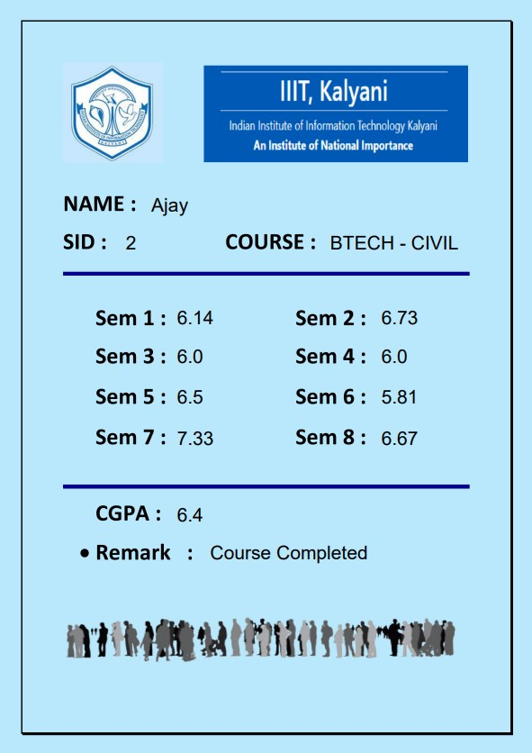

## ✔ STUDENT & COURSE MANAGEMENT SYSTEM
- This is an application regarding Student and Course Database Management System. 

****

### REQUIREMENTS : 
- python 3
- tkinter
- messagebox
- PIL
- mysql.connector
- smtplib
- random
- array
- MIMEMultipart from email.mime.multipart
- MIMEText from email.mime.text
- MIMEBase from email.mime.base
- encoders from email
- fpdf

****

### How this Script works :
- User just need to download the file and run the main.py on their local system.
- On the starting window of the application, user will be able to see STUDENT and FACULTY option, these are for the student and faculty login/signup respectively.
- First any faculty will come and signup with username, email and password. On clicking on signup faculty will reach to new page which will have details regarding student and course.
- Through this window, faculty can register new or existing student by filling the respective table.
- A real time database table will be shown on the right panel of this window.
- Whenever a faculty registers a new student, student ID and randomly generated password will be sent to student email ID, using which student will be able to login and see details regarding the course in which he/she has registered.
- When student login using Student ID and password, it will take student to a new winndow with all details regarding that particular student.
- Student will also be able to see the SGPA's that he/she has scored in each sem.
- Also there will be a Grade_Sheet button, clicking on which a grade sheet pdf will be generated and will be emailed to that particular student.

### Purrpose :
- This scripts helps user to easily get the basic knowledge of how student and course management system works.

****

### SCREENSHOTS :

   
   
   
   
   
   
   

